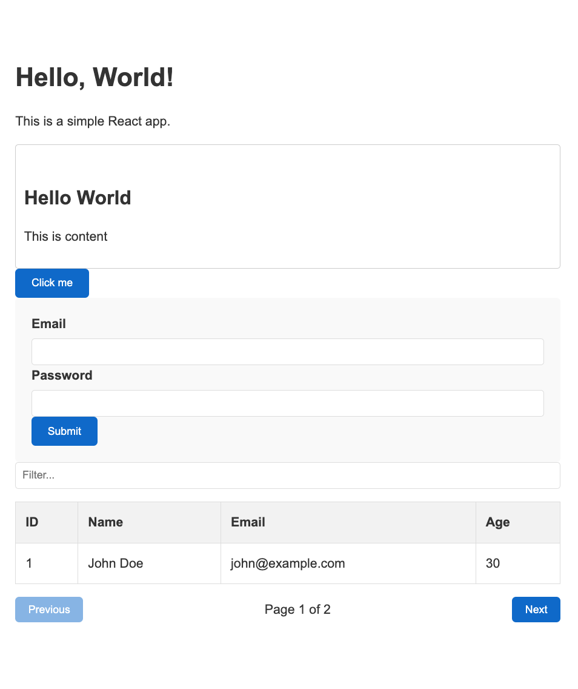

# Hey React Components!
A starter project for React Components.

Add to any React project with:

`$ npm i hey-react-components`

Example usage:

```

import {
  Container, 
  Card, 
  Content, 
  Button,
  Table, 
  Column,
  Form, 
  FormField
  } from 'hey-react-components';

export default function Home() {
  interface User {
    id: number;
    name: string;
    email: string;
    age: number;
  }

  const columns: Column<User>[] = [
    { key: 'id', header: 'ID', sortable: true },
    { key: 'name', header: 'Name', sortable: true },
    { key: 'email', header: 'Email', sortable: true },
    { key: 'age', header: 'Age', sortable: true },
  ];

  const data: User[] = [
    { id: 1, name: 'John Doe', email: 'john@example.com', age: 30 },
    { id: 2, name: 'Jane Smith', email: 'jane@example.com', age: 25 },
    // ... add more data
  ];

  const handleSubmit = (values: Record<string, any>) => {
    console.log('Form submitted with values:', values);
  };

  const validateEmail = (value: string) => {
    if (!value) return 'Email is required';
    if (!/\S+@\S+\.\S+/.test(value)) return 'Invalid email format';
  };

  const validatePassword = (value: string) => {
    if (!value) return 'Password is required';
    if (value.length < 6) return 'Password must be at least 6 characters';
  };

  return (
      <Container>
        <Content>
          <h1>Hello, React!</h1>
          <p>This is a simple React app.</p>
        </Content>  

        <Card title="Hello Card" content="This is content"></Card>

        <Button label="Click me" onClick={() => alert('Clicked!')}></Button>

        <Form onSubmit={handleSubmit}>
          <FormField name="email" label="Email" type="email" validate={validateEmail} />
          <FormField name="password" label="Password" type="password" validate={validatePassword} />
          <button type="submit">Submit</button>
        </Form>

        <Table columns={columns} data={data} itemsPerPage={1} />
      </Container>
  );
} 
```

